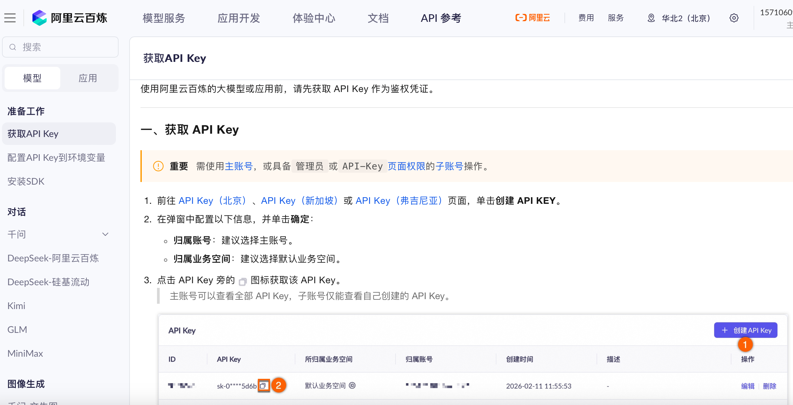
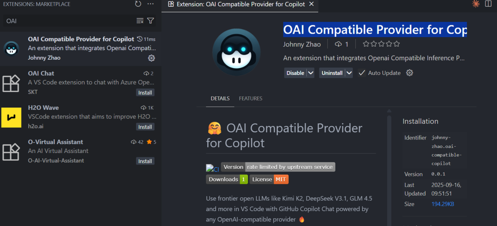
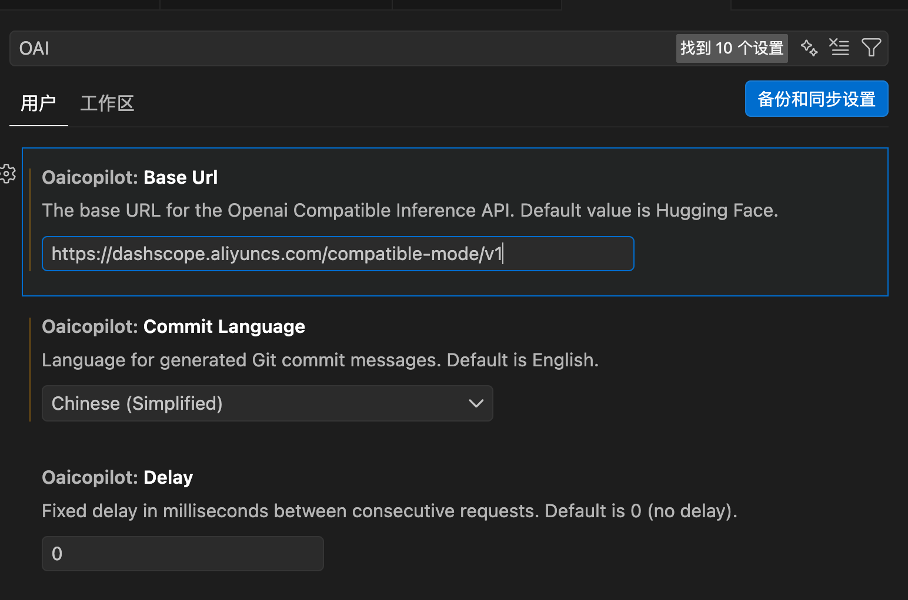
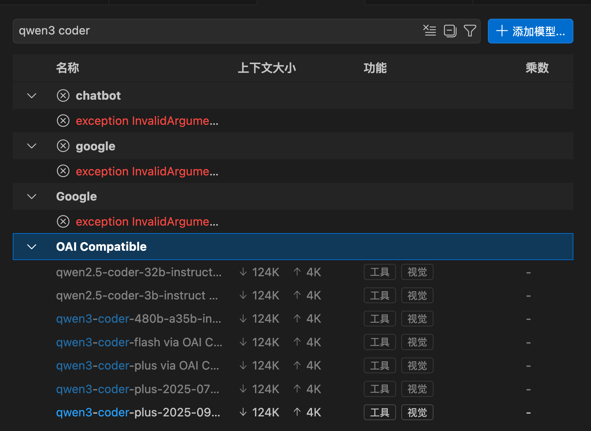

## 获取API

https://bailian.console.aliyun.com/cn-beijing/?tab=api&spm=0.0.0.i1#/api


## 配置到本地变量

```bash
echo "export DASHSCOPE_API_KEY='YOUR_DASHSCOPE_API_KEY'" >> ~/.bashrc
```

## 安装OAI
OAI Compatible Provider for Copilot


>  SDK 调用配置的`base_url`：`https://dashscope.aliyuncs.com/compatible-mode/v1`
> HTTP 请求地址：`POST https://dashscope.aliyuncs.com/compatible-mode/v1/chat/completions`

设置URL：
```
https://dashscope.aliyuncs.com/compatible-mode/v1
```

## Manage Models
打开copilot，右下角点击选择模型，点击Manage Models，添加模型选择OAI Compatible

我选了最后一个，结果问了两个问题花了两块多，不是有免费额度的吗，我是服了，控制台找半天看不到，找客服去


模型用量
https://bailian.console.aliyun.com/cn-beijing/?tab=model#/model-usage/free-quota
## 关于价格
https://billing-cost.console.aliyun.com/home
及时看账单

## 更多参考资料
参考链接：
https://zhuanlan.zhihu.com/p/1951238505524093197

CLI配置：
https://developer.aliyun.com/article/1680177